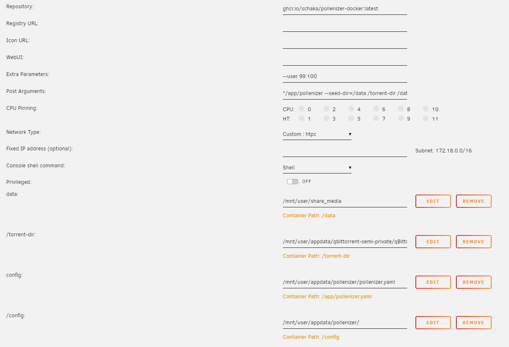

# Docker image pollenizer v4
All I do is provide an Alpine based docker image.
The actual software does not change and you still have to supply the CLI commands yourself.

This can be done via docker-compose, Unraid or a simple Linux CLI command.

### Simple start
```sh
docker run ghcr.io/schaka/pollenizer-docker:latest "/app/pollenizer --help"
```

### Config file
`$HOME` is mapped to `/config`. If the container were to write or read anything from there, it'll find it in your mapped folder.
It also needs a config file called `pollenizer.yaml` mapped to `/app/pollenizer.yaml` inside the container.

It should contain the following content:
```yaml
red:
  api_key: key

ops:
  api_key: key
```

### Run command
As per docs, the command work as follows:
`pollenizer [--red|--ops] [--seed-dir=<DOWNLOADS>] [--seeded-only] <FOLDER_IN> [<FOLDER_OUT>]`

For Unraid:
- Extra Parameters: `--user 99:100`
- Post Arguments: `"/app/pollenizer --help"` (yes, with double quotes)

See this config example screenshot where:
- Post arguments is `"/app/pollenizer --seed-dir=/data /torrent-dir /data/torrent-watch"`
- `/data` is mapped to the same dir as qbit so their paths match
- a `/torrent-dir` is created that points to BT_backup
- a `/torrent-watch` dir is created that keeps all the dumped files
- a `pollenizer.yaml` is mapped into  `/app/pollenizer.yaml` 

